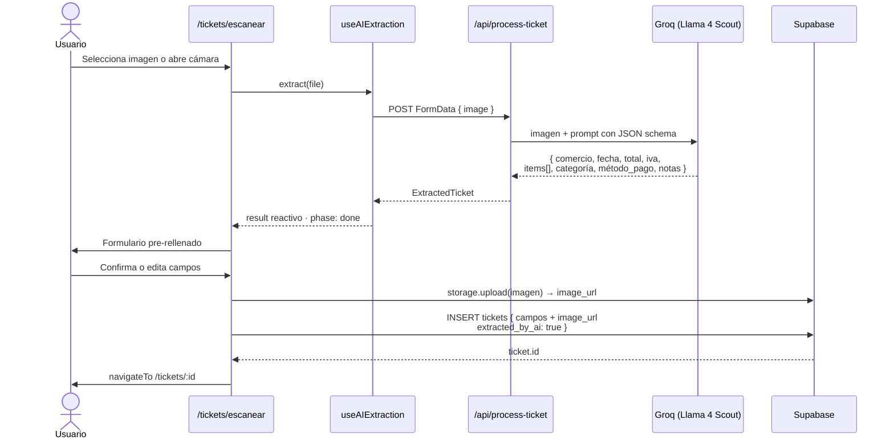
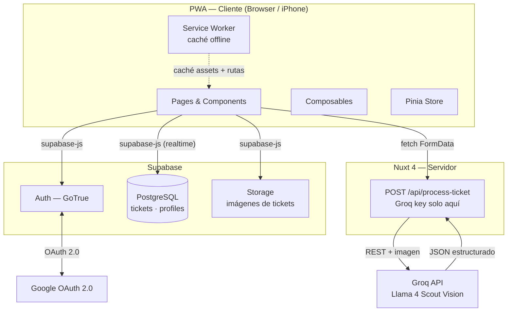
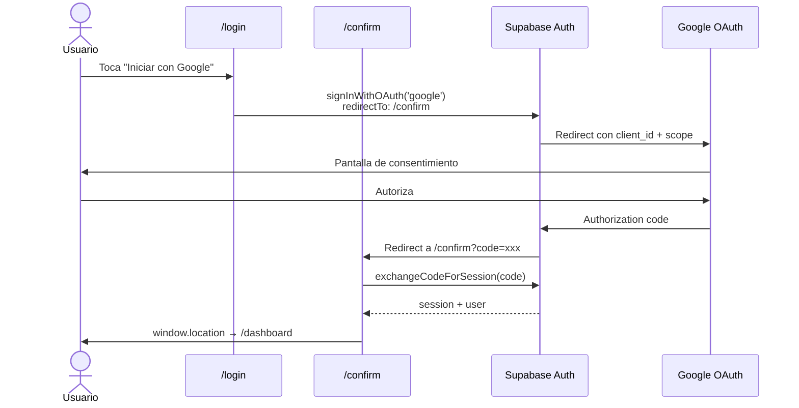
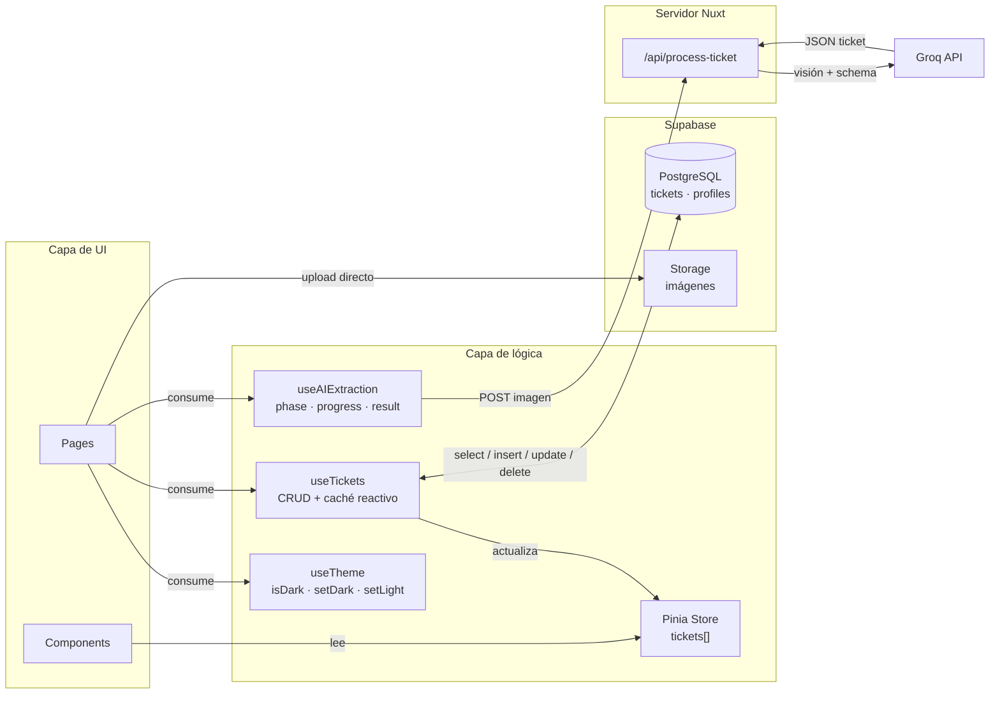

# IAFinanzas

## a. Descripción general del proyecto

**IAFinanzas** es una app mobile-first PWA de gestión de gastos personales. Permite registrar tickets y facturas de dos formas: escaneando la imagen con IA (extrae automáticamente el comercio, fecha, total, IVA, productos, categoría, método de pago y una nota descriptiva) o rellenando un formulario manual. Los gastos se organizan por categoría, se visualizan con gráficos y se almacenan de forma segura en la nube.

Pensada para usarse desde el móvil como una PWA instalable, con una interfaz limpia basada en el tema Dracula de VS Code.

---

## b. Stack tecnológico utilizado

### Tecnologías Core

| Capa                 | Tecnología                                                |
| -------------------- | --------------------------------------------------------- |
| Framework            | Nuxt 4 (Vue 3, Composition API)                           |
| Estilos              | Tailwind CSS v4 con tema Dracula                          |
| Base de datos y auth | Supabase (PostgreSQL + GoTrue)                            |
| IA                   | Groq — modelo `meta-llama/llama-4-scout-17b-16e-instruct` |
| Estado global        | Pinia + `useState` de Nuxt                                |
| Tipado               | TypeScript estricto                                       |

### Design System — Paleta Dracula

Los tokens están definidos en `app/assets/css/main.css` bajo `@theme {}` y se usan como clases de Tailwind v4 (`bg-dracula-bg`, `text-dracula-purple`, etc.). **Nunca usar `tailwind.config.ts`** — todo va en el CSS.

| Token            | Valor     | Uso                           |
| ---------------- | --------- | ----------------------------- |
| `dracula-bg`     | `#282a36` | Fondo principal               |
| `dracula-card`   | `#44475a` | Tarjetas                      |
| `dracula-card2`  | `#383a4a` | Tarjetas secundarias / sheets |
| `dracula-text`   | `#f8f8f2` | Texto principal               |
| `dracula-muted`  | `#6272a4` | Texto secundario              |
| `dracula-purple` | `#bd93f9` | Acento principal              |
| `dracula-pink`   | `#ff79c6` | Acento secundario             |
| `dracula-green`  | `#50fa7b` | Éxito, IA                     |
| `dracula-cyan`   | `#8be9fd` | Info, monospace               |

_Gradiente de acento:_ `linear-gradient(135deg, #bd93f9, #ff79c6)` — FAB, botones primarios, avatares.

---

## c. Información sobre su instalación y ejecución

### Requisitos

- Node.js 20+
- Una cuenta en [Supabase](https://supabase.com) con el proyecto configurado
- Una API key de [Groq](https://console.groq.com) (gratuita, sin tarjeta)

### Instalación

```bash
npm install
```

### Variables de entorno

Crea un archivo `.env` en la raíz del proyecto:

```env
NUXT_PUBLIC_SUPABASE_URL=https://xxxxxxxxxxxx.supabase.co
NUXT_PUBLIC_SUPABASE_KEY=tu_anon_key_de_supabase
NUXT_GROQ_API_KEY=tu_api_key_de_groq
NUXT_PUBLIC_VAPID_PUBLIC_KEY=api_key_push
NUXT_VAPID_PRIVATE_KEY=secret_key_push
NUXT_VAPID_EMAIL=mailto:email@mail.com
NUXT_CRON_SECRET=secret_key
```

### Comandos de ejecución

```bash
npm run dev       # servidor de desarrollo en http://localhost:3000
npm run build     # build de producción (necesario para Vercel, incluye las funciones serverless de la API)
npm run preview   # previsualizar el build de producción localmente
```

---

## d. Estructura del proyecto

### Estructura de directorios

```
app/
├── app.vue                  # Root: NuxtPage + BottomNav + AddTicketSheet + Avisos/Cola
├── pages/
│   ├── login.vue            # Formulario de login y registro
│   ├── confirm.vue          # Callback de OAuth (Supabase exchange code)
│   ├── dashboard/
│   │   └── index.vue        # Vista general y balance mensual
│   ├── tickets/
│   │   ├── index.vue        # Lista con filtros y buscador de tickets
│   │   ├── escanear.vue     # Cámara + extracción IA (Groq)
│   │   ├── manual.vue       # Registro manual de tickets
│   │   └── [id].vue         # Detalle, edición y borrado de tickets
│   ├── estadisticas/
│   │   └── index.vue        # Gráficos de barra y dona por categoría
│   └── perfil/
│       ├── index.vue        # Ajustes de cuenta
│       ├── datos.vue        # Edición de nombre y divisa activa
│       ├── seguridad.vue    # Cambio de contraseña
│       ├── pagos.vue        # Métodos de pago preferidos del usuario
│       ├── ia.vue           # Configuración del prompt y modelo de IA
│       └── notificaciones.vue # Programación de resúmenes diarios/semanales
├── components/
│   ├── TicketCapture.vue    # Control de captura de cámara / selección de archivo
│   ├── layout/
│   │   ├── BottomNav.vue    # Barra de navegación inferior
│   │   ├── AddTicketSheet.vue   # Bottom sheet global para agregar ticket
│   │   ├── MobileHeader.vue     # Header superior con título e indicador de red
│   │   ├── ActualizadorDatos.vue # Sincronizador de base de datos
│   │   ├── AvisoInstalacion.vue  # Banner interactivo para instalar PWA (iOS/Android)
│   │   ├── AvisoOffline.vue      # Indicador visual de pérdida de conexión
│   │   └── EstadoColaTickets.vue # Toast flotante con el estado de tickets pendientes
│   ├── tickets/
│   │   └── CategoryIllustration.vue # Renderizado SVG de iconos de categoría
│   ├── dashboard/
│   ├── stats/
│   └── ui/
├── composables/
│   ├── useTickets.ts        # CRUD completo sincronizado Supabase/IndexedDB
│   ├── useAIExtraction.ts   # Envío de imágenes al servidor para extracción estructurada
│   ├── useMetodoPago.ts     # Fuente única de nombres para métodos de pago
│   ├── useCategories.ts     # Paleta de colores e iconos para categorías
│   ├── useTheme.ts          # Control de tema visual Dracula/Claro
│   ├── usePwaInstaller.ts   # Gestión del prompt de instalación de PWA
│   ├── useOfflineDb.ts      # Cliente local IndexedDB para archivos y tickets
│   ├── useColaTickets.ts    # Cola de sincronización offline con reintentos automáticos
│   └── useColaLecturasDb.ts # DB local de lecturas de tickets procesados
├── stores/
│   └── auth.ts              # Sesión del usuario actual en Supabase Auth
├── middleware/
│   └── auth.ts              # Redirección inteligente si no hay sesión
├── types/
│   └── index.ts             # Definición de interfaces TS
└── assets/css/main.css      # Estilos base y tokens de color de Dracula en @theme

server/
└── api/
    ├── process-ticket.post.ts  # Consulta al modelo Groq Llama 4 Scout Vision
    ├── tickets/
    │   └── sync.post.ts        # Sincronización remota de tickets creados en offline
    └── notifications/
        ├── subscribe.post.ts   # Registro de suscripción web push (suscripción VAPID)
        ├── unsubscribe.post.ts # Remueve suscripción web push
        ├── test.post.ts        # Dispara una notificación de prueba al usuario
        └── send-summary-cron.get.ts # Tarea Cron protegida para envío de resúmenes
```

### Rutas del sistema

| Ruta                     | Auth    | Descripción                                              |
| ------------------------ | ------- | -------------------------------------------------------- |
| `/login`                 | público | Formulario de credenciales e inicio con Google OAuth     |
| `/confirm`               | público | Intercambio de código por sesión activa de Supabase      |
| `/dashboard`             | privado | Resumen financiero, balance mensual y últimos tickets    |
| `/tickets`               | privado | Listado general con buscador y filtros por categoría     |
| `/tickets/escanear`      | privado | Captura con cámara o selección de foto y extracción IA   |
| `/tickets/manual`        | privado | Formulario manual de registro de tickets                 |
| `/tickets/[id]`          | privado | Detalle de ticket, desglose de productos y edición       |
| `/estadisticas`          | privado | Distribución de gastos mensuales y gráficos comparativos |
| `/perfil`                | privado | Menú de ajustes generales                                |
| `/perfil/datos`          | privado | Edición de nombre de usuario, divisa por defecto         |
| `/perfil/seguridad`      | privado | Restablecimiento y actualización de contraseña           |
| `/perfil/pagos`          | privado | Gestión de métodos de pago personalizados                |
| `/perfil/ia`             | privado | Personalización de instrucciones del motor de IA Groq    |
| `/perfil/notificaciones` | privado | Suscripción web push y hora para recibir resúmenes       |

### Convenciones de diseño y desarrollo

- **Tailwind v4**: tokens vía `@theme {}`, nunca `tailwind.config.ts`
- **Auth redirects**: `supabase.redirect: false` — deshabilitados intencionalmente
- **API key de Groq**: solo servidor, nunca en `runtimeConfig.public`
- **Métodos de pago**: usar siempre `formatMetodoPago()` de `useMetodoPago.ts` para mostrar labels legibles ("Tarjeta de crédito" en lugar de "tarjeta_credito")
- **Fechas**: parsear con `T12:00:00` para evitar desfase de zona horaria (`new Date(fecha + 'T12:00:00')`)
- **Bottom sheets**: animación `cubic-bezier(0.32, 0.72, 0, 1)` consistente en toda la app
- **Touch targets**: mínimo 44px de altura en todos los elementos interactivos
- **Border radius**: `rounded-2xl` (16px) para cards, `rounded-3xl` para hero/modales
- **Descarga de tickets**: genera PNG via Canvas API en cliente — incluye items si existen

---

## e. Funcionalidades principales

### 1. Escaneo inteligente de tickets y facturas con IA

Permite registrar tickets automáticamente a partir de una foto o archivo de imagen.

- **Flujo de escaneo:**

```
[Cámara / archivo] → FormData (image)
  → POST /api/process-ticket
    → Groq Llama 4 Scout Vision
    → JSON estructurado (comercio, fecha, total, IVA, items[], categoría, método_pago, notas)
  → useAIExtraction composable
    → result reactivo pre-rellena el formulario
  → createTicket() → Supabase INSERT (incluye items como JSONB)
```

- **Diagrama de secuencia de escaneo:**



- **Endpoint seguro:** El procesamiento de imágenes se realiza exclusivamente en el servidor (`server/api/process-ticket.post.ts`), manteniendo la clave de API de Groq totalmente segura.

### 2. Arquitectura Offline-First (Soporte Offline y Cola de Sincronización)

Diseño resiliente que permite operar en condiciones de nula o baja conectividad.

- **Base de datos local:** Almacenamiento local mediante `IndexedDB` gestionado por `useOfflineDb.ts`.
- **Cola de tareas:** Sincronización en segundo plano mediante `useColaTickets.ts` que monitoriza la conexión y sube los datos a Supabase automáticamente cuando se restablece la red.
- **Service Worker:** Configurado con estrategias personalizadas (`strategy: injectManifest` en `sw.ts`) para almacenar en caché los recursos estáticos y habilitar la instalación PWA.

### 3. Notificaciones Push y Tareas Programadas (Cron)

- **Web Push (VAPID):** Registro de suscripciones (`/api/notifications/subscribe`) para enviar notificaciones web directamente al dispositivo del usuario.
- **Resúmenes programados:** Tarea Cron del sistema (`/api/notifications/send-summary-cron.get.ts`) protegida por un token (`NUXT_CRON_SECRET`), permitiendo el envío recurrente de informes financieros diarios o semanales.

### 4. Soporte PWA Instalable

Optimización de interfaz móvil con soporte nativo de pantalla completa.

- **Configuración de Assets:**
  | Archivo | Uso |
  | ------------------------------ | ------------------------ |
  | `favicon.ico` | Browser tab |
  | `pwa-64x64.png` | Manifest pequeño |
  | `pwa-192x192.png` | Android home screen |
  | `pwa-512x512.png` | Android splash + install |
  | `maskable-icon-512x512.png` | Android adaptive icon |
  | `apple-touch-icon-180x180.png` | iOS "Añadir a inicio" |

- **Generación de iconos:**

```bash
npx pwa-assets-generator --config pwa-assets.config.ts
```

### 5. Persistencia de Datos e Infraestructura

#### Base de datos (Supabase)

**Tabla `tickets`**
| Columna | Tipo | Descripción |
| ----------------- | ----------- | -------------------------- |
| `id` | uuid | PK generado por DB |
| `user_id` | uuid | FK a `auth.users` |
| `comercio` | text | Nombre del comercio |
| `fecha` | date | Fecha de la compra |
| `total` | numeric | Importe total |
| `iva` | numeric | IVA (opcional) |
| `categoria` | text | Enum de categorías |
| `metodo_pago` | text | Método de pago |
| `notas` | text | Observaciones |
| `image_url` | text | URL en Supabase Storage |
| `items` | jsonb | Líneas de productos |
| `extracted_by_ai` | boolean | Si fue extraído por IA |
| `ai_confidence` | numeric | Confianza del modelo (0–1) |
| `created_at` | timestamptz | Timestamp automático |

**Tabla `profiles`**
| Columna | Tipo | Descripción |
| -------------- | ------ | -------------------------------------- |
| `id` | uuid | FK a `auth.users` |
| `nombre` | text | Nombre del usuario |
| `metodos_pago` | text[] | Métodos activos (filtra el formulario) |
| `divisa` | text | Divisa preferida |
| `avatar_url` | text | URL del avatar |

#### Arquitectura de Servicios y Flujo de Datos



#### Flujo de Autenticación con Google



#### Capa de Estado y Acceso a Datos



---

## f. Usuario y contraseña de prueba

Enlace del proyecto desplegado: [https://iafinanzas.vercel.app](https://iafinanzas.vercel.app)

Slides: [IAFinanzas](https://iafinanzas.vercel.app/IAFinanzas.pdf)

Más documentación: carpeta `/docs` (Diseño de Calude design, accesibilidad, arquitectura, seguridad...)

Para poder probar el funcionamiento de la aplicación en su entorno de producción, puedes utilizar las siguientes credenciales de prueba o registrate:

- **Usuario / Email**: `demo@iafinanzas.com`
- **Contraseña**: `DemoIAF2026!`

> [!NOTE]
> La aplicación también admite el inicio de sesión directo a través de **Google OAuth** o bien mediante la creación de un nuevo usuario a través del formulario de registro incorporado.
