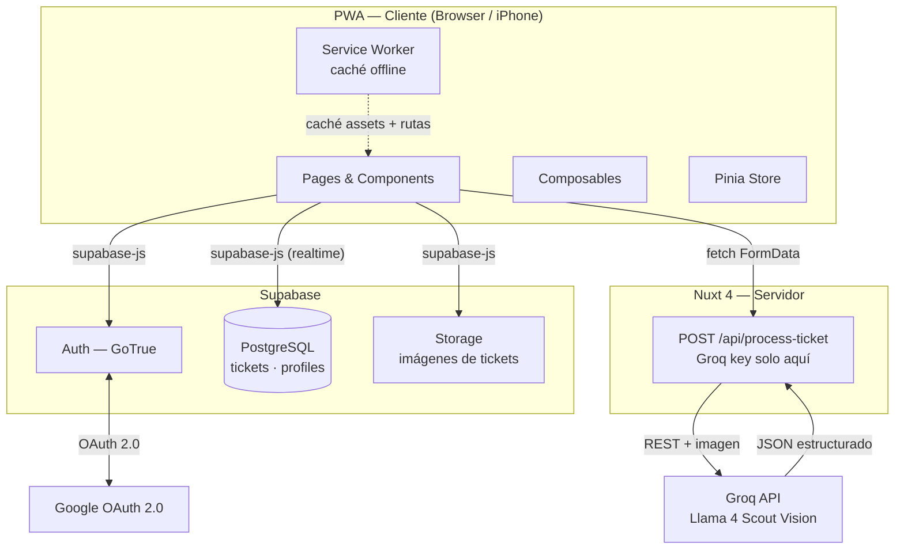
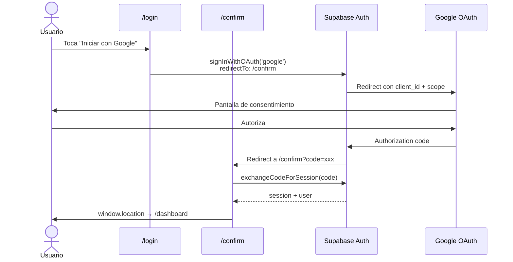
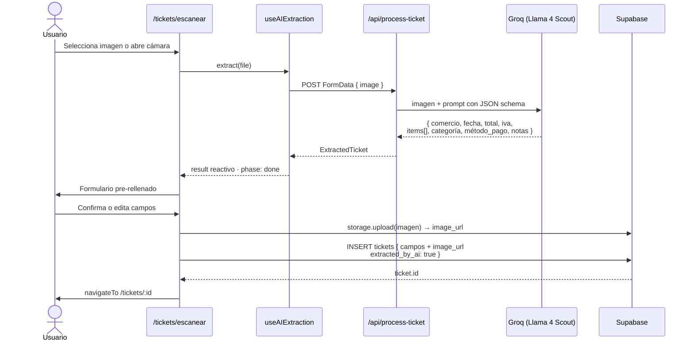
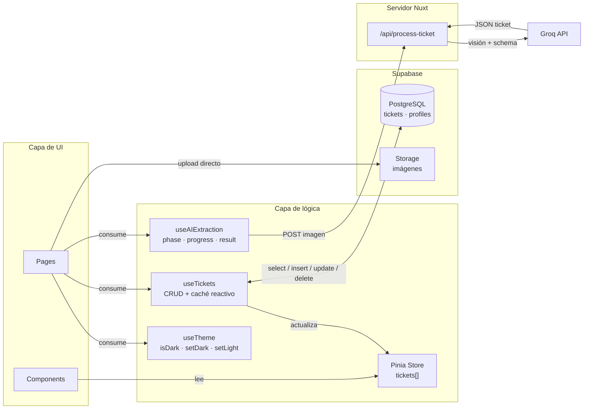

# IAFinanzas

**IAFinanzas** es una app mobile-first PWA de gestión de gastos personales. Permite registrar tickets y facturas de dos formas: escaneando la imagen con IA (extrae automáticamente el comercio, fecha, total, IVA, productos, categoría, método de pago y una nota descriptiva) o rellenando un formulario manual. Los gastos se organizan por categoría, se visualizan con gráficos y se almacenan de forma segura en la nube.

Pensada para usarse desde el móvil como una PWA instalable, con una interfaz limpia basada en el tema Dracula.

---

## Arranque rápido

### Requisitos

- Node.js 20+
- Una cuenta en [Supabase](https://supabase.com) con el proyecto configurado
- Una API key de [Groq](https://console.groq.com) (gratuita, sin tarjeta)

### Instalación

```bash
npm install
```

### Variables de entorno

Crea un archivo `.env` en la raíz del proyecto:

```env
NUXT_GROQ_API_KEY=tu_api_key_de_groq
SUPABASE_URL=https://xxxxxxxxxxxx.supabase.co
SUPABASE_KEY=tu_anon_key_de_supabase
```

### Comandos

```bash
npm run dev       # servidor de desarrollo en http://localhost:3000
npm run build     # build de producción
npm run generate  # generación estática
npm run preview   # previsualizar el build de producción
```

---

## Documentación técnica

### Stack

| Capa | Tecnología |
|------|-----------|
| Framework | Nuxt 4 (Vue 3, Composition API) |
| Estilos | Tailwind CSS v4 con tema Dracula |
| Base de datos y auth | Supabase (PostgreSQL + GoTrue) |
| IA | Groq — modelo `meta-llama/llama-4-scout-17b-16e-instruct` |
| Estado global | Pinia + `useState` de Nuxt |
| Tipado | TypeScript estricto |

### Estructura de directorios

```
app/
├── app.vue                  # Root: NuxtPage + BottomNav + AddTicketSheet
├── pages/
│   ├── login.vue
│   ├── dashboard.vue
│   ├── tickets/
│   │   ├── index.vue        # Lista con filtros por categoría
│   │   ├── escanear.vue     # Cámara + extracción IA
│   │   ├── manual.vue       # Formulario manual
│   │   └── [id].vue         # Detalle, edición y eliminación
│   ├── estadisticas.vue
│   └── perfil/
│       ├── index.vue
│       ├── datos.vue
│       ├── seguridad.vue
│       ├── pagos.vue        # Métodos de pago activos del usuario
│       └── ia.vue
├── components/
│   ├── layout/
│   │   ├── BottomNav.vue
│   │   └── AddTicketSheet.vue   # Bottom sheet global (FAB)
│   ├── tickets/
│   │   └── CategoryIllustration.vue
│   ├── dashboard/
│   ├── stats/
│   └── ui/
├── composables/
│   ├── useTickets.ts        # CRUD completo de tickets
│   ├── useAIExtraction.ts   # Lógica de llamada al endpoint IA
│   └── useMetodoPago.ts     # formatMetodoPago — fuente única de labels
├── stores/
│   ├── auth.ts
│   └── tickets.ts
├── middleware/
│   └── auth.ts              # Redirige a /login si no hay sesión
├── types/
│   └── index.ts             # Ticket, CreateTicketDto, UserProfile, etc.
└── assets/css/main.css      # Tokens Dracula en @theme {}

server/
└── api/
    └── process-ticket.post.ts  # Endpoint IA: recibe imagen, devuelve JSON
```

### Flujo de escaneo con IA

```
[Cámara / archivo] → FormData (image)
  → POST /api/process-ticket
    → Groq Llama 4 Scout Vision
    → JSON estructurado (comercio, fecha, total, IVA, items[], categoría, método_pago, notas)
  → useAIExtraction composable
    → result reactivo pre-rellena el formulario
  → createTicket() → Supabase INSERT (incluye items como JSONB)
```

El endpoint vive exclusivamente en el servidor (`server/api/`) y nunca expone la API key al cliente.

### Base de datos (Supabase)

**Tabla `tickets`**

| Columna | Tipo | Descripción |
|---------|------|-------------|
| `id` | uuid | PK generado por DB |
| `user_id` | uuid | FK a `auth.users` |
| `comercio` | text | Nombre del comercio |
| `fecha` | date | Fecha de la compra |
| `total` | numeric | Importe total |
| `iva` | numeric | IVA (opcional) |
| `categoria` | text | Enum de categorías |
| `metodo_pago` | text | Método de pago |
| `notas` | text | Observaciones |
| `image_url` | text | URL en Supabase Storage |
| `items` | jsonb | Líneas de productos |
| `extracted_by_ai` | boolean | Si fue extraído por IA |
| `ai_confidence` | numeric | Confianza del modelo (0–1) |
| `created_at` | timestamptz | Timestamp automático |

**Tabla `profiles`**

| Columna | Tipo | Descripción |
|---------|------|-------------|
| `id` | uuid | FK a `auth.users` |
| `nombre` | text | Nombre del usuario |
| `metodos_pago` | text[] | Métodos activos (filtra el formulario) |
| `divisa` | text | Divisa preferida |
| `avatar_url` | text | URL del avatar |

### Design system — Paleta Dracula

Los tokens están definidos en `app/assets/css/main.css` bajo `@theme {}` y se usan como clases de Tailwind v4 (`bg-dracula-bg`, `text-dracula-purple`, etc.). **Nunca usar `tailwind.config.ts`** — todo va en el CSS.

| Token | Valor | Uso |
|-------|-------|-----|
| `dracula-bg` | `#282a36` | Fondo principal |
| `dracula-card` | `#44475a` | Tarjetas |
| `dracula-card2` | `#383a4a` | Tarjetas secundarias / sheets |
| `dracula-text` | `#f8f8f2` | Texto principal |
| `dracula-muted` | `#6272a4` | Texto secundario |
| `dracula-purple` | `#bd93f9` | Acento principal |
| `dracula-pink` | `#ff79c6` | Acento secundario |
| `dracula-green` | `#50fa7b` | Éxito, IA |
| `dracula-cyan` | `#8be9fd` | Info, monospace |

Gradiente de acento: `linear-gradient(135deg, #bd93f9, #ff79c6)` — FAB, botones primarios, avatares.

### PWA

Iconos generados con `@vite-pwa/assets-generator` desde `public/logo_IAFianza.png`. Configuración en `nuxt.config.ts` — display `standalone` (muestra barra de estado del SO, oculta la UI del browser).

| Archivo | Uso |
|---|---|
| `favicon.ico` | Browser tab |
| `pwa-64x64.png` | Manifest pequeño |
| `pwa-192x192.png` | Android home screen |
| `pwa-512x512.png` | Android splash + install |
| `maskable-icon-512x512.png` | Android adaptive icon |
| `apple-touch-icon-180x180.png` | iOS "Añadir a inicio" |

Para regenerar iconos:

```bash
npx pwa-assets-generator --config pwa-assets.config.ts
```

### Convenciones

- **Tailwind v4**: tokens vía `@theme {}`, nunca `tailwind.config.ts`
- **Auth redirects**: `supabase.redirect: false` — deshabilitados intencionalmente
- **API key de Groq**: solo servidor, nunca en `runtimeConfig.public`
- **Métodos de pago**: usar siempre `formatMetodoPago()` de `useMetodoPago.ts` para mostrar labels legibles ("Tarjeta de crédito" en lugar de "tarjeta_credito")
- **Fechas**: parsear con `T12:00:00` para evitar desfase de zona horaria (`new Date(fecha + 'T12:00:00')`)
- **Bottom sheets**: animación `cubic-bezier(0.32, 0.72, 0, 1)` consistente en toda la app
- **Touch targets**: mínimo 44px de altura en todos los elementos interactivos
- **Border radius**: `rounded-2xl` (16px) para cards, `rounded-3xl` para hero/modales
- **Descarga de tickets**: genera PNG via Canvas API en cliente — incluye items si existen

### Rutas

| Ruta | Auth | Descripción |
|------|------|-------------|
| `/login` | público | Login + OAuth |
| `/dashboard` | privado | Balance y últimos tickets |
| `/tickets` | privado | Lista con filtros |
| `/tickets/escanear` | privado | Escaneo con IA |
| `/tickets/manual` | privado | Formulario manual |
| `/tickets/[id]` | privado | Detalle, edición y eliminación |
| `/estadisticas` | privado | Gráficos por período |
| `/perfil` | privado | Configuración del usuario |
| `/perfil/datos` | privado | Datos personales |
| `/perfil/pagos` | privado | Métodos de pago activos |
| `/perfil/ia` | privado | Preferencias del motor IA |

---

## Infraestructura y navegación de datos

### Arquitectura de servicios

Visión global de los servicios externos y cómo se conectan con el cliente y el servidor.



---

### Flujo de autenticación con Google

Cómo viajan las credenciales desde el botón de login hasta la sesión activa en el cliente.



---

### Flujo de escaneo con IA

Recorrido de la imagen desde la cámara hasta el ticket guardado en base de datos.



---

### Capa de estado y acceso a datos

Cómo los componentes acceden a los datos a través de composables, store y servicios remotos.


