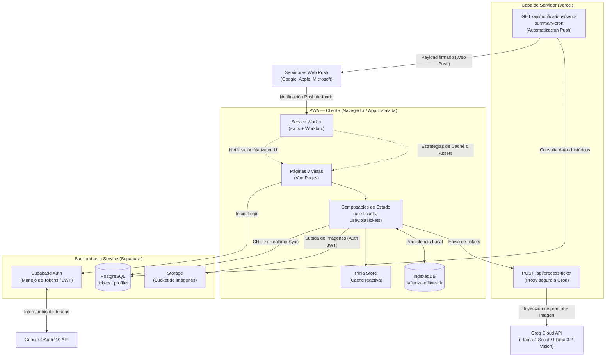

# Documentación Técnica y Arquitectura: IA Finanzas

## 1. Visión Estratégica e Ingeniería de Software

> **Texto de Referencia:**
> _"La ingeniería de software moderna ha dejado de ser una actividad puramente artesanal de escribir código para convertirse en una disciplina estratégica centrada en gestionar la incertidumbre, la complejidad operativa y alinear la tecnología con los objetivos reales del negocio."_

**IA Finanzas** materializa esta visión transformando la gestión de finanzas personales en una solución robusta y adaptada a las necesidades reales del usuario móvil contemporáneo. En el desarrollo de software, la excelencia no se mide por la cantidad de código escrito de forma artesanal, sino por la capacidad del sistema de responder de forma resiliente a los retos del entorno.

### Gestión de la Incertidumbre

- **Conectividad Volátil:** En situaciones reales de compra (como sótanos o comercios sin señal), el registro manual o por IA suele fallar en apps tradicionales. IA Finanzas reduce la incertidumbre implementando una arquitectura **Offline-First**. Los recursos se sirven de forma instantánea gracias a Service Workers, y las operaciones fallidas debido a la falta de conexión se encolan de manera segura en el almacenamiento local del dispositivo.
- **Variabilidad en Datos Físicos:** Los tickets de compra varían radicalmente en formato, tipografía e idioma (incluyendo soporte multilingüe/catalán). El uso de un motor de visión por Inteligencia Artificial (LLM) mitiga esta incertidumbre al estructurar datos complejos y no normalizados en un esquema de datos predecible y consistente.

### Mitigación de la Complejidad Operativa

- El sistema delega la pesada carga de gestionar y mantener servidores backend tradicionales a una infraestructura serverless ágil y autogestionada mediante **Supabase** (BaaS) y **Vercel** (Serverless Functions), permitiendo escalar el producto sin aumentar la fricción operativa del equipo de ingeniería.
- La complejidad del análisis y la categorización manual de gastos se automatiza en milisegundos mediante el procesamiento en la nube con modelos avanzados de Groq Cloud, reduciendo drásticamente la carga cognitiva del usuario.

### Alineación con los Objetivos del Negocio

- El objetivo principal es la **captura de gastos sin fricción**. Reducir el tiempo necesario para registrar un gasto de minutos a segundos incrementa de forma directa la retención de los usuarios y la precisión de sus balances financieros.
- La interfaz y la estética premium del tema **Dracula** no solo reducen la fatiga visual, sino que se integran orgánicamente en el entorno de desarrollo y preferencias del público objetivo de la aplicación.

---

## 2. Arquitectura del Sistema y Stack Tecnológico

La aplicación está diseñada bajo el patrón de Single Page Application (SPA) optimizada para dispositivos móviles y soportada por servicios en la nube descentralizados.



### Frontend & UI/UX (Mobile-First)

- **Framework Principal:** [Nuxt 4](file:///C:/Users/david/Documents/Icnea/cartera/nuxt.config.ts) en modo SPA (`ssr: false`). Esto asegura que la aplicación se cargue en su totalidad una vez y funcione de manera autónoma en el cliente, factor indispensable para su comportamiento offline.
- **Sistema de Diseño:** [Tailwind CSS v4](file:///C:/Users/david/Documents/Icnea/cartera/package.json), con las variables y tokens definidos directamente en [main.css](file:///C:/Users/david/Documents/Icnea/cartera/app/assets/css/main.css) bajo la directiva `@theme`. No se utiliza un archivo de configuración separado, lo cual facilita la compilación en tiempo de ejecución.
- **Tema Dracula:** Implementación detallada con soporte nativo para Modo Claro/Oscuro dinámico, controlando la inyección de la clase `.light` en la etiqueta `<html>` a través del composable [useTheme.ts](file:///C:/Users/david/Documents/Icnea/cartera/app/composables/useTheme.ts).
- **Adaptación Mobile e Interfaces Premium:**
    - Targets táctiles optimizados con un tamaño e interactividad mínima de **44px de altura** para cualquier enlace o botón interactivo (especificado en la base de estilos de [main.css](file:///C:/Users/david/Documents/Icnea/cartera/app/assets/css/main.css)).
    - Gestos e interacciones fluidas mediante hojas inferiores (Bottom Sheets) animadas con curvas Bézier (`cubic-bezier(0.32, 0.72, 0, 1)`) y bordes suavizados de tipo `rounded-3xl` (20px) y `rounded-2xl` (16px) en tarjetas y botones.
- **Prototipado e Integración:** Diseños hifi validados desde las maquetas de Claude Design en `docs/diseño/project/Cartera.html` e implementados de forma responsiva.
- **PWA e Instalación:** Integrado mediante [@vite-pwa/nuxt](file:///C:/Users/david/Documents/Icnea/cartera/nuxt.config.ts) e configurado bajo una estrategia de `injectManifest`. El Service Worker personalizado en [sw.ts](file:///C:/Users/david/Documents/Icnea/cartera/app/sw.ts) controla de manera fina el almacenamiento en caché estática y la cola de Background Sync. Para mejorar la interacción móvil:
    - *Instalación Híbrida PWA:* Implementación del composable [usePwaInstaller.ts](file:///C:/Users/david/Documents/Icnea/cartera/app/composables/usePwaInstaller.ts) y del componente [AvisoInstalacion.vue](file:///C:/Users/david/Documents/Icnea/cartera/app/components/layout/AvisoInstalacion.vue) al pie del Login y del Dashboard, permitiendo disparar de forma nativa la instalación en Android Chrome (mediante `beforeinstallprompt`) o proveer una guía de pasos nativa de Safari en iOS.
    - *Bifurcación de Cámara/Galería en Android:* Se solventó una limitación de Android Chrome en el selector de imágenes dividiendo el menú de acción de [AddTicketSheet.vue](file:///C:/Users/david/Documents/Icnea/cartera/app/components/layout/AddTicketSheet.vue) en dos botones condicionales ("Cámara" con `capture="environment"` y "Galería") únicamente para Android, manteniendo el flujo nativo unificado en iOS/Escritorio.

### Backend & Almacenamiento (Supabase BaaS)

- **Base de Datos Relacional:** Servidor gestionado de **PostgreSQL** en Supabase.
- **Autenticación de Usuarios:** Integración de `Supabase Auth` con soporte para login tradicional y OAuth 2.0 con cuentas de Google, asegurado en el cliente mediante el middleware de rutas [auth.ts](file:///C:/Users/david/Documents/Icnea/cartera/app/middleware/auth.ts).
- **Estructura de Base de Datos:**
    - **Tabla `tickets`:** Contiene datos normalizados de transacciones. Emplea la columna tipo `jsonb` para almacenar las líneas detalladas de productos (items), lo que permite conservar la flexibilidad de esquemas no relacionales para desgloses sin penalizar las consultas SQL rápidas.
    - **Tabla `profiles`:** Registra las preferencias del usuario, métodos de pago personalizados (`text[]`) e información del avatar.
- **Almacenamiento de Archivos:** Bucket dedicado en _Supabase Storage_ para guardar imágenes físicas de los comprobantes y facturas.
- **Soporte Offline-First (IndexedDB):** Si la app detecta que no hay conexión, usa [useOfflineDb.ts](file:///C:/Users/david/Documents/Icnea/cartera/app/composables/useOfflineDb.ts) (librería `idb`) para almacenar los tickets de forma transitoria en el almacén local `tickets-pendientes` o guardar copias rápidas de la base de datos completa en `tickets-snapshots` para lecturas sin conexión.

### Procesamiento de IA (Groq Cloud API)

- **Arquitectura de Extracción:** El cliente envía la imagen mediante un formulario multipart al endpoint del servidor `/api/process-ticket` ([process-ticket.post.ts](file:///C:/Users/david/Documents/Icnea/cartera/server/api/process-ticket.post.ts)). Este endpoint actúa como una pasarela segura (Proxy) que inyecta la API Key privada del modelo de IA desde las variables de entorno.
- **Motor de Visión:** Emplea modelos avanzados de visión, principalmente `meta-llama/llama-4-scout-17b-16e-instruct` o `llama-3.2-11b-vision-preview`, alimentados con un prompt estructurado de extracción para obtener una respuesta JSON rígida de acuerdo con la interfaz de tipos de la app.
- **Normalización y Tolerancia:**
    - Traduce y extrae fechas en catalán u otros idiomas.
    - Formatea los campos a tipos estrictos (ej. parseo de fechas con hora fija `T12:00:00` en [useTickets.ts](file:///C:/Users/david/Documents/Icnea/cartera/app/composables/useTickets.ts) para eludir el desfase de zona horaria del cliente).
    - Asigna niveles de confianza y método de pago coincidente a partir de los perfiles de usuario.

---

## 3. DevOps, CI/CD y Control de Versiones

La entrega de valor continua y la estabilidad del código se gestionan a través de flujos modernos de integración y despliegue automatizados.

```
                  [ GitHub Repository ]
                           │
                 Push to 'master' branch
                           │
                           ▼
                  [ Vercel Pipeline ]
                           │
            ┌──────────────┴──────────────┐
            ▼                             ▼
    [ prebuild hook ]             [ build / deploy ]
   node bump-version.js           nuxt build --preset vercel
  (Auto patch increment)                  │
            │                             ▼
            ▼                    [ Vercel Serverless ]
    package.json version         Despliegue a Producción
   explicada en RuntimeConfig    https://iafinanzas.vercel.app
```

### Control de Versiones y Repositorio

- Alojado en un repositorio remoto de **GitHub**.
- Control de versiones semántico e incremental basado en la especificación SemVer (`MAJOR.MINOR.PATCH`).
- Trazabilidad completa de cambios documentada y visible directamente en el menú de la aplicación gracias a la integración del archivo [package.json](file:///C:/Users/david/Documents/Icnea/cartera/package.json) con la variable de entorno pública de Nuxt `runtimeConfig.public.version`.

### CI/CD (Automatización de Despliegue)

- **Plataforma de Despliegue:** Vercel.
- **Pipeline Automático:** Cada push o combinación de rama a la rama principal `master` dispara de forma automática un ciclo de compilación en Vercel.
- **Incremento de Versión Automatizado:** Durante el ciclo de compilación, Vercel ejecuta el script [bump-version.js](file:///C:/Users/david/Documents/Icnea/cartera/bump-version.js) en su hook de `prebuild`. Este script parsea el archivo [package.json](file:///C:/Users/david/Documents/Icnea/cartera/package.json), incrementa el número del parche (`0.1.x` -> `0.1.x+1`) y escribe el resultado antes de compilar la aplicación. Esto asegura que cada despliegue a producción lleve un identificador de versión único e incremental sin necesidad de intervención manual.
- **Entornos Seguros:** Las variables de entorno de producción (APIs de Groq, credenciales de base de datos y llaves de VAPID) están configuradas de forma aislada e inyectadas por Vercel únicamente en tiempo de ejecución de las Serverless Functions.

---

## 4. Seguridad y Metodologías Aplicadas

El proyecto prioriza la seguridad del usuario y la robustez de los datos. Se han implementado correcciones estrictas alineadas directamente con el estándar internacional **OWASP (Open Web Application Security Project) Top 10 API Security Risks**.

### Seguridad OWASP y Mitigación de Riesgos

La aplicación cuenta con las siguientes protecciones documentadas en [seguridadOWASP.md](file:///C:/Users/david/Documents/Icnea/cartera/docs/seguridadOWASP.md):

| Vulnerabilidad OWASP                                                 | Riesgo Identificado                                                                                                                                                                        | Solución Implementada                                                                                                                                                                                                                                                                                                                                                                                                   |
| :------------------------------------------------------------------- | :----------------------------------------------------------------------------------------------------------------------------------------------------------------------------------------- | :---------------------------------------------------------------------------------------------------------------------------------------------------------------------------------------------------------------------------------------------------------------------------------------------------------------------------------------------------------------------------------------------------------------------- |
| **BOLA / IDOR** _(API1:2023 - Broken Object Level Authorization)_    | Un usuario malintencionado podría inyectar tickets falsos en la cuenta de otro usuario si solo se valida el inicio de sesión básico en Base de Datos.                                      | Políticas estrictas de **Row Level Security (RLS)** en la base de datos de Supabase. El sistema de políticas exige que el campo `user_id` del ticket coincida siempre con el ID de sesión del usuario autenticado (`auth.uid()`).                                                                                                                                                                                       |
| **SSRF** _(API10:2023 - Unsafe Consumption of APIs / API8:2023)_     | Un usuario podría suscribir una URL maliciosa o interna del servidor para el envío de notificaciones push, provocando fugas de claves o espionaje de la red interna.                       | Implementación de una lista de confianza (**whitelist**) de dominios autorizados de servicios push (Google, Apple, Mozilla, Windows) en el endpoint [/api/notifications/subscribe](file:///C:/Users/david/Documents/Icnea/cartera/server/api/notifications/subscribe.post.ts). Las peticiones a dominios no listados se rechazan de inmediato.                                                                          |
| **Acceso Roto** _(API5:2023 - Broken Function Level Authorization)_  | El endpoint `/api/process-ticket` de procesamiento de tickets IA estaba expuesto públicamente, permitiendo a atacantes externos realizar consumos abusivos del motor de IA.                | Cierre del endpoint público. Se añadieron middlewares de autenticación en el servidor Nuxt para validar que solo usuarios con sesiones de Supabase válidas puedan consumir el procesador de IA.                                                                                                                                                                                                                         |
| **DoS de Memoria** _(API4:2023 - Unrestricted Resource Consumption)_ | El envío de archivos o imágenes de tamaño masivo (100MB+) saturaba la RAM del servidor serverless al intentar decodificar la imagen en memoria, provocando la caída del servicio.          | Límite estricto de subida establecido en **7 MB** por comprobante. La conexión se aborta en el servidor antes de realizar cualquier tipo de preprocesamiento en memoria.                                                                                                                                                                                                                                                |
| **Secrets & Misconfiguration** _(API7:2023)_                         | La clave secreta para ejecutar el envío automático de resúmenes (Cron Job) estaba escrita directamente en el código fuente. Las restricciones de RLS bloqueaban al programador automático. | Traslado completo de la clave `NUXT_CRON_SECRET` a variables de entorno cifradas. Modificación del endpoint [/api/notifications/send-summary-cron](file:///C:/Users/david/Documents/Icnea/cartera/server/api/notifications/send-summary-cron.get.ts) para usar la llave administrativa (`Service Role Key`) de Supabase para obtener usuarios respetando la privacidad pero garantizando la correcta ejecución del job. |

### Metodologías de Desarrollo y Estándares de Código

- **Visual Fidelity Integrada:** Flujo de trabajo basado en la recreación pixel-perfect de diseños estructurados por herramientas avanzadas (Claude Design).
- **Clean Architecture & Composable Pattern:** Separación total de la lógica de presentación (UI) y la lógica de estado/controladores. Toda lógica de mutación de datos reside en composables reutilizables y con tipado estricto:
    - [useTickets.ts](file:///C:/Users/david/Documents/Icnea/cartera/app/composables/useTickets.ts) gestiona el CRUD de transacciones e interactúa directamente con Supabase.
    - [useAIExtraction.ts](file:///C:/Users/david/Documents/Icnea/cartera/app/composables/useAIExtraction.ts) maneja el flujo de carga y extracción estructurada de los datos.
- **TypeScript Estricto:** Tipado completo de todas las entidades (interfaces de `Ticket`, `Profile`, `CreateTicketDto`, etc.) para prevenir errores de tipo en tiempo de ejecución.
- **Pruebas Automatizadas:** Configuración de pruebas unitarias y de integración de componentes usando **Vitest** y `@vue/test-utils` para garantizar la estabilidad del código ante futuros parches.

---

## 5. Casos de Uso y Funcionalidades Core

IA Finanzas simplifica el flujo de gestión a través de flujos claros y flujos offline automáticos.

```
             ┌────────────────────────────────────────────────────────┐
             ▼                                                        │
[ CÁMARA O ARCHIVO ] ──► POST /api/process-ticket ──► Groq Vision API │
                                                              │       │
                                                              ▼       │
   [ GUARDADO ] ◄── Confirma campos ◄── Formulario con datos estructurados
        │
   ┌────┴────────────────────────┐
   ▼                             ▼
( Online )                  ( Offline )
Upload a Supabase Storage    Guardado en IndexedDB (tickets-pendientes)
Insert en Supabase DB        Service Worker Background Sync al recuperar red
```

### A. Registro de Tickets con Inteligencia Artificial (IA)

1.  **Captura:** El usuario toma una fotografía de su ticket físico desde su teléfono móvil o selecciona una imagen de su galería en [/tickets/escanear](file:///C:/Users/david/Documents/Icnea/cartera/app/pages/tickets/escanear.vue).
2.  **Extracción Serverless:** La imagen se transmite de forma cifrada al endpoint del servidor. El modelo de visión de Groq extrae:
    - _Comercio, Fecha, IVA, Total Facturado, Productos desglosados, Método de pago sugerido, Categoría y una Nota resumida._
3.  **Confirmación Interactiva:** El composable reactivo [useAIExtraction.ts](file:///C:/Users/david/Documents/Icnea/cartera/app/composables/useAIExtraction.ts) devuelve el resultado estructurado para pre-rellenar el formulario en la pantalla del usuario. Éste puede editar o corregir cualquier dato antes de enviarlo.
4.  **Almacenamiento Directo:** Al confirmar, la imagen se sube al Bucket de Supabase Storage para obtener la URL pública, y el ticket se inserta en la tabla correspondiente de PostgreSQL.

### B. Registro Manual de Gastos

- Diseñado para escenarios rápidos donde no se dispone de un ticket físico. Permite al usuario rellenar los datos básicos a través de un formulario con accesibilidad táctil optimizada en [/tickets/manual](file:///C:/Users/david/Documents/Icnea/cartera/app/pages/tickets/manual.vue).
- Los métodos de pago se obtienen de forma dinámica de acuerdo con las configuraciones guardadas en el perfil de usuario.

### C. Categorización y Análisis Visual

- **Organización por Colores e Iconos:** Los gastos se dividen en categorías semánticas claras y representativas que se vinculan visualmente con la paleta de colores del tema Dracula.
- **Análisis Dinámico:** La sección [/estadisticas](file:///C:/Users/david/Documents/Icnea/cartera/app/pages/estadisticas/index.vue) genera gráficos visuales que analizan los gastos por categoría o período temporal, ayudando a los usuarios a entender la distribución de su capital de manera inmediata.

### D. Automatización de Resúmenes mediante Web Push

- **Suscripciones VAPID:** El usuario autoriza las notificaciones nativas en el navegador. La suscripción generada se cifra y se guarda en la base de datos vinculada a su perfil.
- **Cron Jobs:** El servidor de tareas ejecuta de manera recurrente el trigger cron, calculando los gastos del periodo correspondiente. La tarea genera de manera inteligente un mensaje resumen personalizado y lo despacha a través de los servidores oficiales push de Google, Apple o Microsoft, notificando directamente al usuario en su pantalla de bloqueo.
